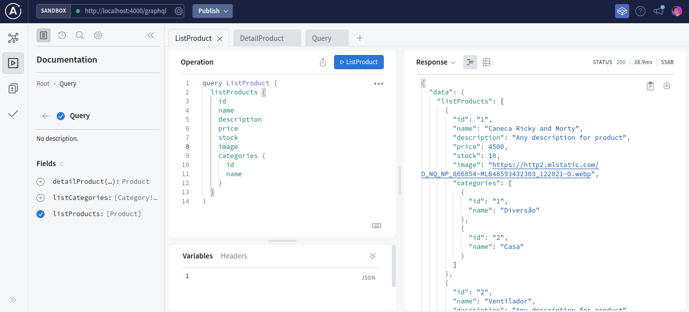

# Showcase Apollo Federation

I create this app to study more about Apollo Federation after know the advantages for scalability and resilience of this tool. This showcase is a simple product listing that provide information from external services with in memory data. The app contain two subgraphs and one gateway.

This project can be an incorrect modeling because I just read the documentation, but I'll improve this.

